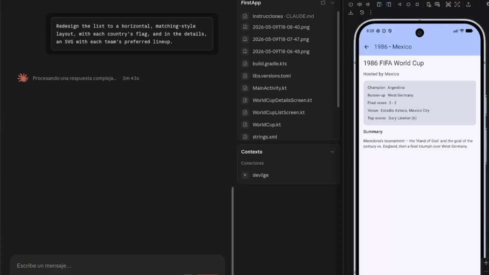

# devilge

> Model Context Protocol (MCP) server that lets an AI assistant — typically Claude — develop, drive, and observe an Android / KMM app end-to-end.

`devilge` exposes 33 tools that cover the full inner loop: read the project, build it, install it, launch it, drive its UI, capture errors and network traffic, run tests. Anything an LLM coding agent would otherwise have to ask the user to do manually.

<p align="center">
  
</p>

## What's inside

| Category | Tools | Purpose |
| --- | --- | --- |
| **Device read** (8) | `list_devices`, `get_logcat`, `get_app_errors`, `inspect_packages`, `resize_logcat_buffer`, `get_network_calls`, `get_compose_preview_source`, `list_compose_previews` | Observe device + project state |
| **Project static** (6) | `get_project_structure`, `list_compose_previews_tree`, `run_gradle_task`, plus build-result parsers (kotlinc/javac/ksp errors, JUnit XML, Lint XML) | Inspect Gradle/KMM project + run any Gradle task |
| **Device drive** (7) | `take_screenshot`, `dump_ui`, `input_tap`, `input_text`, `input_key`, `input_swipe`, `set_input_visualization` | Manipulate the running app |
| **Locators + waits** (6) | `tap_text`, `tap_resource_id`, `set_text`, `wait_for_text`, `wait_for_resource_id`, `wait_for_idle` | Semantic UI navigation, no coordinate magic |
| **Lifecycle** (5) | `launch_app`, `force_stop_app`, `clear_app_data`, `install_apk`, `run_instrumented_tests` | Cold-start app, run Espresso tests, fast install |
| **Maestro flows (optional)** (3) | `run_maestro_flow`, `list_maestro_flows`, `validate_maestro_flow` | Reusable YAML flows for recurring navigation |
| **Composition** (1) | `batch` | Chain multiple devilge tools in one round trip |
| **Misc** (1) | `get_compose_previews_tree` (hierarchical) | — |

215 unit tests in Vitest, all green. Strict TypeScript (`strict`, `noUncheckedIndexedAccess`).

### Batching for fewer permission prompts

Hosts that confirm every tool call (Claude Desktop, Cowork) can become noisy when the agent walks through multi-step UI flows. `devilge_batch` collapses a sequence into a single MCP call so the user approves once for the whole sequence.

```jsonc
// Tap "Settings", wait, screenshot, tap a row, screenshot — one approval.
{
  "actions": [
    { "name": "devilge_tap_text",       "input": { "text": "Settings" } },
    { "name": "devilge_wait_for_idle",  "input": { "timeoutMs": 5000 } },
    { "name": "devilge_take_screenshot" },
    { "name": "devilge_tap_text",       "input": { "text": "Wallpaper & style" } },
    { "name": "devilge_take_screenshot" }
  ]
}
```

Rules: capped at 20 actions per call; cannot be nested; cannot include destructive tools (`devilge_clear_app_data`, `devilge_install_apk`) — those always require their own dedicated prompt; stops on the first error and reports which step failed.

All tools also expose MCP `annotations` (`readOnlyHint`, `idempotentHint`, `destructiveHint`, `openWorldHint`). Hosts that respect annotations can auto-approve safe reads and prompt only on state-changing tools.

## Architecture

Clean / hexagonal layering, every concern replaceable in isolation:

```
src/
├── config/                 # Config loading, structured logger, typed errors
├── domain/
│   ├── entities/           # Pure data types
│   └── ports/              # Interfaces the application talks to
├── application/            # Use cases — orchestrate ports, no IO of their own
├── infrastructure/
│   ├── adb/                # AdbAdapter, AdbAppController, runners, parsers
│   ├── build/              # Gradle adapter + parsers (compile errors, JUnit, Lint)
│   ├── maestro/            # Optional Maestro adapter + YAML validator
│   ├── network/            # Ktor logcat parser + header sanitizer
│   ├── scanners/           # ComposePreviewScanner, ProjectScanner, FileWalker
│   └── security/           # PathValidator, CommandSanitizer
└── presentation/
    └── tools/              # MCP tool definitions (Zod schemas + handlers)
```

`src/server.ts` is the *composition root*: it constructs every concrete dependency and wires them into an `McpServer`. Nothing else in the codebase performs construction.

## Security model

devilge runs on a developer's machine, exposes mutating tools to an LLM, and shells out to ADB and (optionally) Gradle / Maestro. It assumes the operator connects only to a **dev emulator or wiped test device**, never a personal device with logged-in apps.

- **Project sandbox.** All filesystem reads/writes resolve, after symlink resolution, to paths inside `DEVILGE_ANDROID_PROJECT_ROOT` or the configured outputs / flows roots. Any escape throws `SecurityError`.
- **No shell.** Every external process (`adb`, `gradlew`, `maestro`) is spawned with `shell: false` and an argv array. Arguments are never concatenated into strings.
- **Strict argument allowlists.** Device serials, logcat tags, package names, activity names, deep links, Gradle tasks, Maestro flow names and env-var keys all pass through `CommandSanitizer` regex allowlists before reaching argv.
- **Resource caps.** Logcat capped (5000 line ceiling), ADB stdout cap 8 MiB, Gradle output cap 256 KiB ring buffer, file scans bounded, screenshot timeout 15 s, instrumented-test timeout 30 min default cap.
- **Symlinks ignored.** Walkers never follow symlinks.
- **Logs go to stderr only.** Stdout is reserved for the MCP JSON-RPC transport.
- **Errors are sanitized.** Only `DevilgeError` subclasses surface their messages. Unexpected exceptions become an opaque `INTERNAL_ERROR`.
- **Header redaction.** `Authorization`, `Cookie`, `Set-Cookie`, `X-API-Key` and other well-known sensitive headers are redacted from `get_network_calls` output.
- **Maestro `runScript:` denied by default.** YAML flows containing `runScript:` blocks (which execute JS) are rejected unless the operator explicitly sets `DEVILGE_ALLOW_FLOW_SCRIPTS=true`.
- **No frontmost-app check.** devilge does NOT verify that the targeted package matches the device's foreground app. That check is a deployment concern — keep your dev device clean.

The MVP **does** include write tools (input automation, app install, data wipe, force-stop). These are gated to a dev-only device by operator policy, not by server logic.

## Setup

```bash
cd devilge
npm install
cp .env.example .env
# edit .env with your project's absolute path
npm run build
```

Run the tests:

```bash
npm test
```

Verify the build:

```bash
npm run typecheck    # static type-check (no emit)
npm run build        # emit dist/
npm run lint         # eslint
```

### Connecting to Claude Desktop

Add an entry to your `claude_desktop_config.json` (path varies by OS):

```json
{
  "mcpServers": {
    "devilge": {
      "command": "node",
      "args": ["/absolute/path/to/devilge/dist/index.js"],
      "env": {
        "DEVILGE_ANDROID_PROJECT_ROOT": "/absolute/path/to/your/android/project",
        "DEVILGE_KTOR_LOG_TAG": "HttpClient"
      }
    }
  }
}
```

Restart Claude Desktop. The 31 tools should appear in the tool picker.

### Local smoke test (MCP Inspector)

```bash
DEVILGE_ANDROID_PROJECT_ROOT=/absolute/path/to/your/android/project \
DEVILGE_KTOR_LOG_TAG=HttpClient \
npx --yes @modelcontextprotocol/inspector \
  node dist/index.js
```

## Configuration reference

| Variable | Required | Default | Description |
| --- | --- | --- | --- |
| `DEVILGE_ANDROID_PROJECT_ROOT` | ✅ | — | Absolute path to the Android/KMM project. All file reads are sandboxed under this directory. |
| `DEVILGE_ADB_PATH` |  | `adb` (from PATH) | Absolute path to the `adb` binary. Pinning is recommended. |
| `DEVILGE_DEFAULT_DEVICE_SERIAL` |  | — | Default `serial` used when a tool call omits it. Useful when several devices are attached. |
| `DEVILGE_LOGCAT_MAX_LINES` |  | `500` | Default cap for `get_logcat`. Hard upper bound: 5000. |
| `DEVILGE_LOG_LEVEL` |  | `info` | One of `error`, `warn`, `info`, `debug`. |
| `DEVILGE_KTOR_LOG_TAG` |  | `HttpClient` | Logcat tag the HTTP-client logger writes under. Use `HttpClient` for Ktor (default), `OkHttp` for Retrofit/OkHttp, or whatever your custom logger uses. |
| `DEVILGE_HTTP_LOG_FORMAT` |  | `auto` | Which parser(s) to apply. `ktor`, `okhttp`, or `auto` (tries both). |
| `DEVILGE_OUTPUTS_ROOT` |  | `<project>/.devilge-outputs/` | Where screenshots / UI dumps land. Add to `.gitignore`. |
| `DEVILGE_FLOWS_ROOT` |  | `<project>/devilge-flows/` | Where Maestro YAML flows live. |
| `DEVILGE_MAESTRO_BIN_PATH` |  | auto-detected from PATH | Absolute path to the `maestro` binary. Optional — Maestro tools degrade gracefully when missing. |
| `DEVILGE_ALLOW_FLOW_SCRIPTS` |  | `false` | Set to `true` to allow `runScript:` blocks inside Maestro YAML. Off for safety. |

## Optional integrations

### Maestro (flows)

Maestro is **optional**. Without it installed, every other devilge tool keeps working. The three flow tools (`run_maestro_flow`, `list_maestro_flows`, `validate_maestro_flow`) register unconditionally and return `MAESTRO_NOT_INSTALLED` when the binary isn't found.

To enable:

```bash
brew tap mobile-dev-inc/tap
brew install maestro

# or
curl -Ls "https://get.maestro.mobile.dev" | bash
```

Restart the inspector. Flows go in `<project>/devilge-flows/<name>.yaml`. Example:

```yaml
appId: com.example.your.app
---
- launchApp:
    clearState: true
- tapOn: "Email"
- inputText: ${EMAIL}
- tapOn: "Password"
- inputText: ${PASSWORD}
- tapOn: "Sign in"
- assertVisible: "Home"
```

Then:

```json
{
  "name": "login_flow",
  "params": { "EMAIL": "user@example.com", "PASSWORD": "..." }
}
```

`MAESTRO_DISABLE_ANALYTICS=true` is injected automatically. `runScript:` blocks are denied unless you opt in.

### Headless Compose preview rendering (recipe, no devilge tool)

You can render `@Preview` Composables to PNG without launching the full app. **devilge does NOT add a dedicated tool for this** — the existing `run_gradle_task` plus the official Google plugin cover it cleanly, and adding a wrapper would make us depend on Gradle conventions that vary by project.

This is **completely optional**: if you don't add the plugin, devilge runs unchanged. You only lose this specific workflow.

To enable in your project, add to your Compose module's `build.gradle.kts`:

```kotlin
plugins {
    // existing plugins...
    id("com.android.compose.screenshot") version "0.0.1-alpha10"
}

android {
    experimentalProperties["android.experimental.enableScreenshotTest"] = true
}
```

And in `gradle/libs.versions.toml`:

```toml
[plugins]
composeScreenshot = { id = "com.android.compose.screenshot", version = "0.0.1-alpha10" }
```

Once the plugin is in place, render previews from the LLM via the existing tool:

```json
devilge_run_gradle_task {
  "task": ":composeApp:validateDebugScreenshotTest"
}
```

The PNGs land under `composeApp/build/outputs/screenshotTest/...`. Claude can then read them via its Read tool to verify visual output without installing the app.

## Recommended inner-loop workflow

```
1. run_gradle_task ":composeApp:assembleDebug"   # build once at start
2. install_apk { "module": ":composeApp" }       # ~5-8 s vs Gradle's 30-60 s
3. launch_app { "packageName": "...", "clean": true }
4. tap_text / set_text / wait_for_text           # navigate to the screen
5. take_screenshot                               # confirm visual state
6. get_app_errors { "followMs": 10000 }          # capture errors as they happen
7. get_network_calls                             # verify HTTP requests
8. on bug → edit code → back to step 1 (Gradle is incremental, fast)
```

For recurring navigation paths (login, search, etc.), capture once as a Maestro flow and replay with one tool call.

## Backlog (not committed, lowest priority)

- **Compose Live Edit MCP** — true HMR for Android Compose. Major project (~2-3 months MVP, JVMTI agent + bytecode transformation + protocol). Waiting for JetBrains' Compose Hot Reload to land for Android first; the wrapper would be ~1-2 weeks.
- **`pull_room_database`** — pull Room SQLite from device, expose readonly queries. Useful for inspecting cached state.
- **`pull_anr_traces`** + **`deobfuscate_stacktrace`** — diagnose runtime hangs and ProGuard-mapped release crashes.
- **`dumpsys_meminfo` / `dumpsys_gfxinfo` / `measure_cold_start`** — runtime performance metrics.
- **`describe_compose_codebase`** — structural map of the project (data classes, XML resources, color literal frequencies, composables) so the LLM doesn't have to grep at session start. Considered, deferred until proven necessary in real use.

## License

MIT
